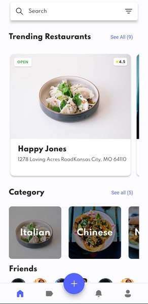
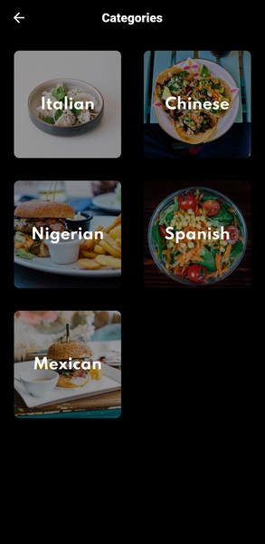
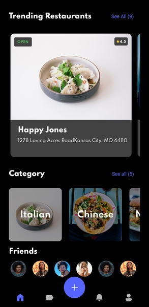
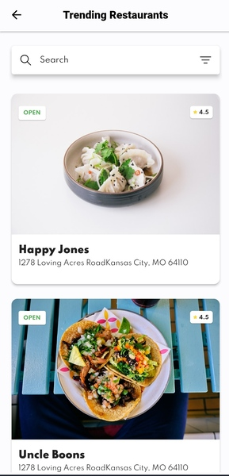

# Foodybyte

Template took from Github project. [Foodybite by JideGuru](https://github.com/JideGuru/FlutterFoodybite).\
For avoiding conflicts changed a letter (i -> y).
Credits to the Owner. Just made some changes to code and added theme changing, [Flutter Hooks](https://pub.dev/packages/flutter_hooks) support, responsiveness and Linting.

## 📸 Screenshots

   

     

## How to Use

**Step 1:**

Download or clone this repository by using the link below:

```bash
https://github.com/anrbyrm/foodybyte.git
```

**Step 2:**

Go to project root and execute the following command in console to get the required dependencies:

```bash
flutter pub get
```

### Features

* Navigation Bar
* Navigation
* Linting
* Dark Theme Support
* Light Theme Support
* Flutter Hooks Support
* BLoc Support
* Responsiveness

### Libraries & Tools Used

* [Equatable](https://pub.dev/packages/equatable)
* [Fluent System Icons](https://pub.dev/packages/fluentui_system_icons)
* [BLoc](https://pub.dev/packages/flutter_bloc)
* [Flutter Hooks](https://pub.dev/packages/flutter_hooks)
* [Sizer](https://pub.dev/packages/sizer)
* [Very Good Analysis](https://pub.dev/packages/very_good_analysis)

### Folder Structure

```text
foodybyte/
|- android
|- assets
|- build
|- ios
|- lib
```

Folder structure inside lib

```text
|- bloc
|- screens
|- util
|- widgets
```

### Conclusion

It will be nice to answer your questions about the project even though I am not the owner. Feel free to ask what you need.
